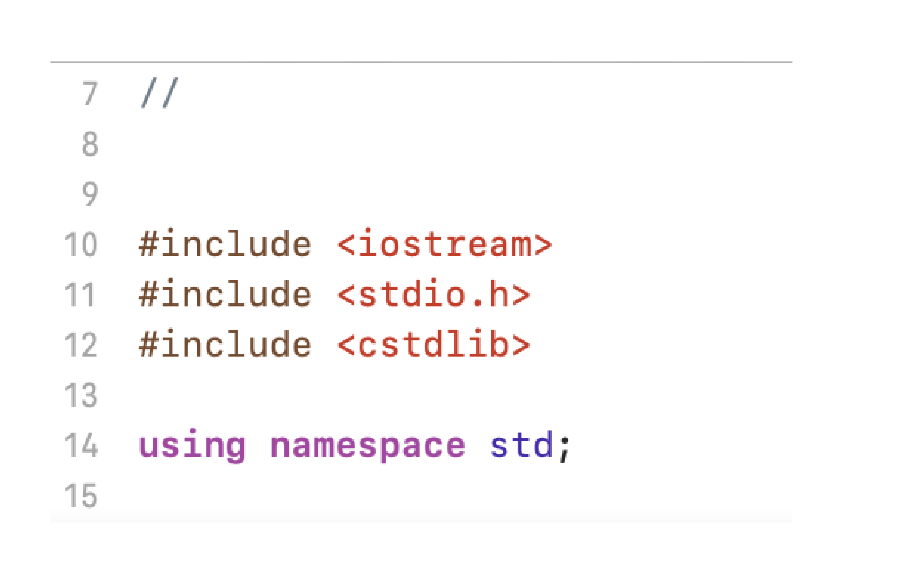

# Question-3-CSCI-313

GROUP 2- Luke Fang, Gomes Mikhaiel, Hila Ergys, Ibrat Nazara, Kaur Rupinder

Create a sort for 2d matrices. Do a bubble sort, insertion sort, and selection sort
variation of this.

# Libraries

# Main function
I create a 2d array and print statements to enter value for rows and columns. And a for loop to iterate through the array and which helps to gather the data. 

# Bubble sort
Next, we wanted to sort the array using the bubble sort method. So, then I need a function to implement bubble sort. For that we use loops (for loop) and swap methods. Bubble Sort is basically the simplest sorting algorithm that works by repeatedly swapping the adjacent elements if they are in wrong order. 

# Conclusion
After that the program will run properly and provide a sorted list.

